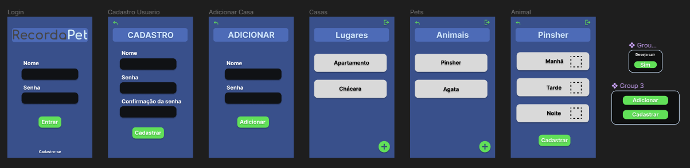
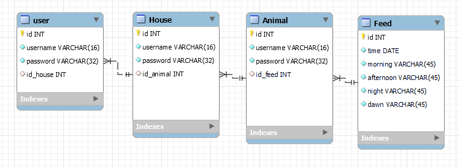

# RecordaPet

## Sobre o app

Este aplicativo auxilia na gestão da alimentação dos animais em sua residência, especialmente quando múltiplas pessoas estão envolvidas no cuidado, assegurando que os animais sejam sempre alimentados pontualmente e permitindo que todos possam acompanhar o controle.

## Como rodar o projeto

Primeiramente, se você ainda não tem o Node e Yarn instalados, acompanhe o [tutorial de instalação](https://docs.google.com/document/d/19-0HcZK2Jd_CDPh7jDLcqdaBCVfxMNwam1U8Sbfv5aw/edit).

Clone o repositório atual. Se você não sabe como fazer isso, acompanhe o [tutorial oficial](https://docs.github.com/pt/repositories/creating-and-managing-repositories/cloning-a-repository) do GitHub.

Em um terminal, na pasta do respositório clonado, rode o seguintes comandos:

```bash
$> cd project/

// Se você usa android
$> yarn android

// Se você usa IOS
$> yarn ios
```

## Funcionalidades
- [ ] Cadastro de usuario
- [ ] Login
- [ ] Cadastro das casas
- [ ] Cadastro dos animais
- [ ] Visualização de casas
- [ ] Visualização de animais na residência
- [ ] Cadastro da alimentação
- [ ] Visualização das alimentações

## Protótipos de tela



## Modelagem do banco de dados



## Planejamento
| Atividade | Tempo previsto | Data limite |
| ----------- | ----------- | ----------- |
| Configuração de roteamento     | 3 dias      | 28/04/2024 |
| Configuração de middlewares de autenticação    | 3 dias      | 28/04/2024 |
| Instalação e configurações de bibliotecas     | 2 dias      | 28/04/2024 |
| Área de autenticação    | 1 semana      | 26/05/2024 |
| Cadastro das casas    | 4 dias     | 26/05/2024 |
| Cadastro dos animais    | 1 dia      | 26/05/2024 |
| Listagem das casas    | 4 dias    | 26/05/2024 |
| Listagem dos animais    | 1 dia     | 26/05/2024 |
| Cadastro da alimentação    | 1 dias      | 26/05/2024 |
| Listagem das alimentações    | 2 semanas      |16/06/2024 |
